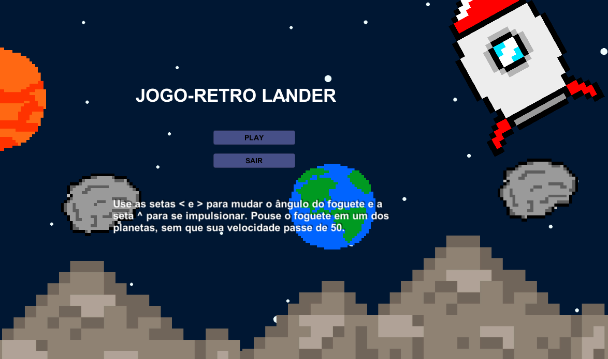
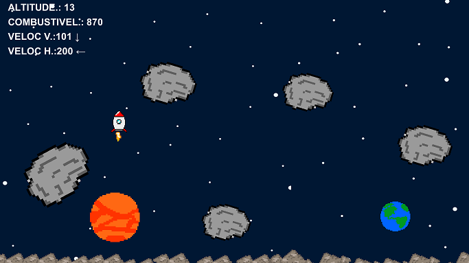

# Jogo - Retro Lander Personalizado
## Por: Francisco Henrique da Silva Fuzari de Souza

### Este projeto é um jogo 2D criado na Unity com C#, este jogo é a versão personalizada de um outro RetroLander que fiz, porém este contém PixelArts autorais.

### O jogo possui apenas uma fase, onde seu objetivo é pousar o foguete em segurança em um dos planetas, você deve controlar o ângulo do foguete e sua propulsão, para não colidir com muita velocidade nos planetas e explodir ao pousar.

## Para Executar:
* WEB: Na pasta Executável-WEB Rode o arquivo index.html e ele abrirá no seu navegador.
* PC: Na pasta Executável-PC rode o arquivo RetroLander.exe e ele abrirá em sua máquina.
